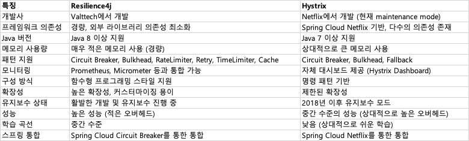

# spring cloud circuit breaker

## history
- 2018년 netflix는 hystrix 프로젝트를 유지보수 모드로 전환한다고 발표하여 spring cloud 2020.0.0 부텅 지원이 제거되었다
- 이에 대체 라이브러리인 Resilence4j가 등장하며 대체되었다.

## Resilience4j vs Hystrix

## starter
- non-reactive
  - `org.springframework.cloud:spring-cloud-starter-circuitbreaker-resilience4j`
- reactive
  - `org.springframework.cloud:spring-cloud-starter-circuitbreaker-reactor-resilience4j`